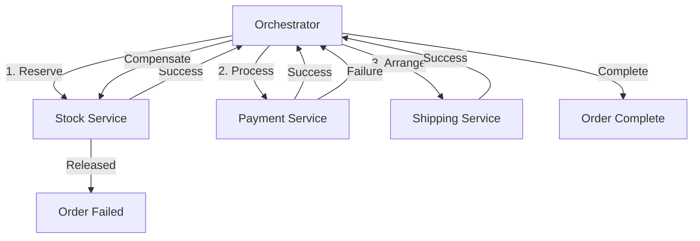
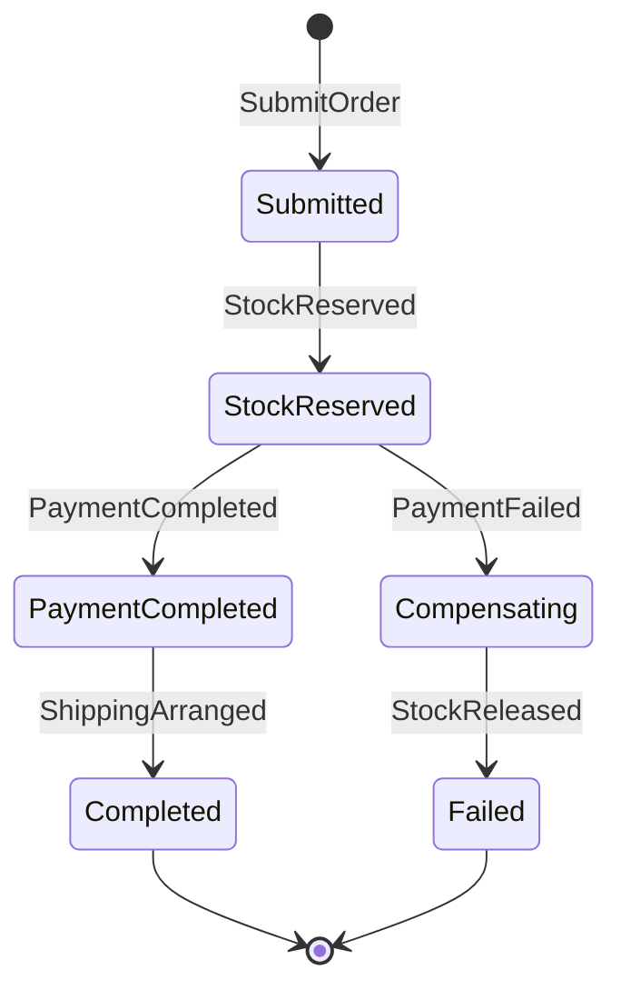
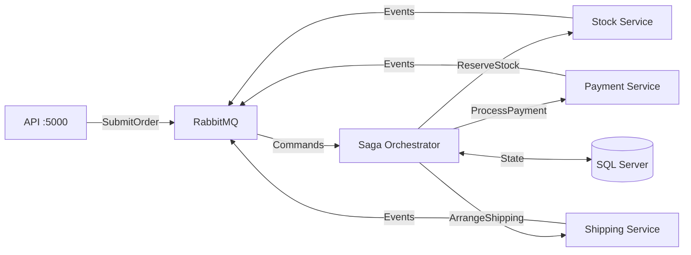
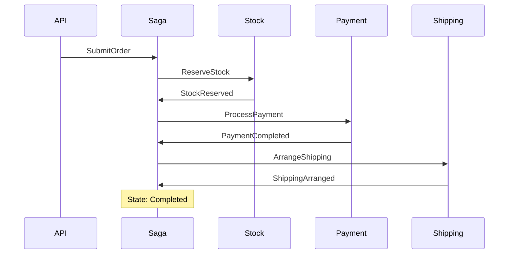
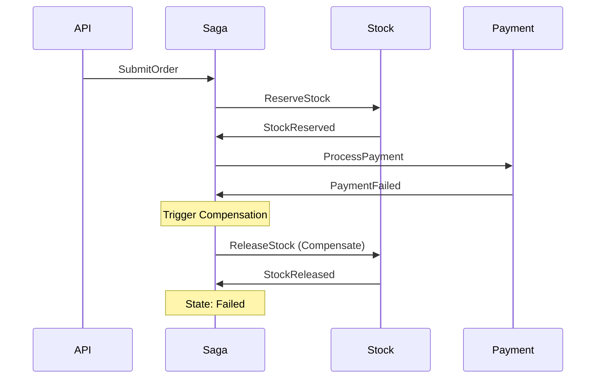
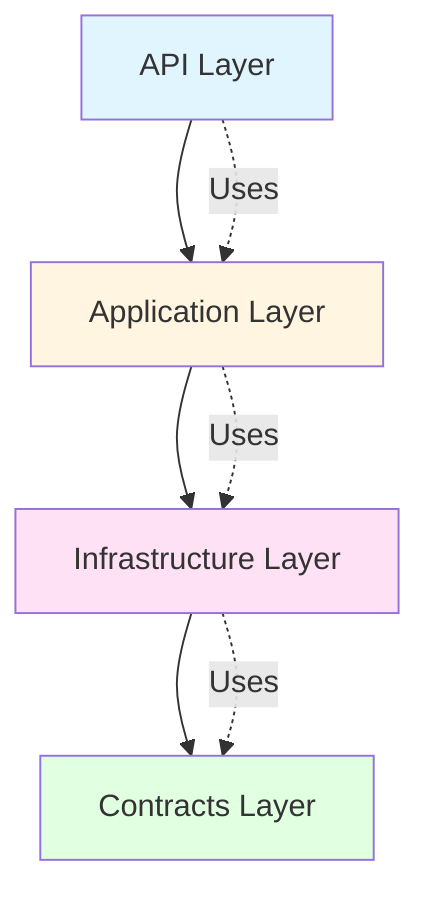

# Saga Pattern Demo with MassTransit

## What Is This?

A complete working example demonstrating how to build reliable distributed microservices that handle failures gracefully without traditional distributed transactions (2PC).

**What it does:**
- Processes orders across multiple services (Stock → Payment → Shipping)
- Automatically rolls back when failures occur
- Never leaves the system in an inconsistent state
- Handles compensation logic reliably

**Stack:** .NET 10 · MassTransit · RabbitMQ · SQL Server · Docker

---

## Why the Saga Pattern?

### The Problem

In a typical e-commerce order flow, you need to:

1. Reserve inventory (Stock Service)
2. Charge payment (Payment Service)
3. Arrange shipping (Shipping Service)

**What happens when payment fails after you've reserved stock?**

Traditional try/catch approaches fail because you can't guarantee the "undo" operations succeed—services might be down, networks might fail, or processes might crash mid-rollback. This leaves your system in an inconsistent state.

### The Solution

The Saga Pattern coordinates distributed transactions using:
- **Local transactions** in each service
- **Compensating transactions** to undo completed steps
- **Persistent state** to track progress
- **Reliable messaging** (Outbox/Inbox patterns)

This demo implements **orchestration-based sagas** where a central coordinator manages the workflow.

---

## Quick Start

### Prerequisites

- Docker Desktop (Windows/Mac)/Rancher Desktop (Windows/Mac) or Docker Engine + Compose (Linux)
- 4GB RAM available for containers
- Ports 5000, 5672, 1433, 15672 available

> **Note:** No .NET SDK required to run the demo—everything runs in containers.

### Start Everything

```bash
# 1. Navigate to project
cd SagaDemo

# 2. Start all services (60-90 seconds on first run)
docker compose up --build

# 3. Wait for "healthy" status on all 7 services
```

You should see:
```
✅ saga-rabbitmq       (healthy) - Message broker
✅ saga-sqlserver      (healthy) - Saga state database
✅ saga-api           (running) - REST API
✅ saga-orchestrator  (running) - Saga coordinator
✅ saga-stock         (running) - Stock service
✅ saga-payment       (running) - Payment service  
✅ saga-shipping      (running) - Shipping service
```

### Verify It's Working

| Check | URL | Expected |
|-------|-----|----------|
| API responding | http://localhost:5000/health | `{"status":"Healthy"}` |
| RabbitMQ Management | http://localhost:15672 (guest/guest) | 5 queues visible |
| Create test order | Use HTTP file or curl | Returns orderId |

---

## Core Concepts

### What is a Saga?

A **Saga** manages distributed transactions by breaking them into:
1. **Local transactions** - each service commits its work locally
2. **Compensating transactions** - each forward step has an "undo" operation

If any step fails, the saga executes compensations to roll back completed work.

### Orchestration vs Choreography

This demo uses **orchestration** where a central coordinator directs the workflow:



**Alternative: Choreography** (not used here)  
Each service listens to events and decides what to do next. Harder to understand and debug, but more decoupled.

> **TL;DR:** Orchestration = one coordinator tells everyone what to do. Choreography = services react to events independently.

### Compensation Example

Every action has a compensating action:

| Forward Action | Compensation |
|----------------|-------------|
| Reserve Stock | Release Stock |
| Process Payment | Refund Payment |
| Arrange Shipping | Cancel Shipping |

### Saga States



**Expected results** when running the demo:
- ~70% orders complete successfully
- ~10% fail at stock reservation
- ~20% fail at payment (triggers compensation)

---

## Testing

### Method 1: HTTP Test File (Recommended)

The project includes `SagaDemo.http` with all API calls ready to use.

**VS Code:**
1. Install [REST Client extension](https://marketplace.visualstudio.com/items?itemName=humao.rest-client)
2. Open `SagaDemo.http`
3. Click "Send Request" above any request

**JetBrains Rider:**
1. Open `SagaDemo.http` (HTTP files are natively supported)
2. Click ▶ play button next to any request

**Sample request:**
```http
### Create Order
POST http://localhost:5000/orders
Content-Type: application/json

{
  "customerEmail": "john@example.com",
  "productName": "MacBook Pro",
  "quantity": 1,
  "totalAmount": 2499.99
}
```

**Response:**
```json
{
  "orderId": "3fa85f64-5717-4562-b3fc-2c963f66afa6",
  "status": "Submitted"
}
```

Then check status:
```http
### Get Order by ID
GET http://localhost:5000/orders/{{orderId}}
```

<details>
<summary>Method 2: Using curl (click to expand)</summary>

```bash
# Create order
curl -X POST http://localhost:5000/orders \
  -H "Content-Type: application/json" \
  -d '{
    "customerEmail": "john@example.com",
    "productName": "MacBook Pro",
    "quantity": 1,
    "totalAmount": 2499.99
  }'

# Check order status (replace GUID)
curl http://localhost:5000/orders/3fa85f64-5717-4562-b3fc-2c963f66afa6

# Get all orders
curl http://localhost:5000/orders
```
</details>

### Watch It Work

```bash
# Follow orchestrator logs to see state transitions
docker compose logs -f saga-orchestrator

# You'll see output like:
# Processing order 3fa85f64...
# Transitioning to StockReserved
# Transitioning to PaymentCompleted
# Transitioning to Completed
```

**Orders typically process in 1-3 seconds.**

---

## Architecture

### System Overview



### Service Responsibilities

| Service | Purpose | Persistent State |
|---------|---------|------------------|
| **API** | HTTP endpoints for order operations | No |
| **Saga Orchestrator** | Coordinates workflow, manages saga state | Yes (SQL) |
| **Stock Service** | Reserves/releases inventory (10% failure) | No |
| **Payment Service** | Processes payments (20% failure) | No |
| **Shipping Service** | Arranges deliveries | No |
| **RabbitMQ** | Message broker for reliable delivery | Yes |
| **SQL Server** | Saga state + Outbox/Inbox tables | Yes |

### Message Flow - Success Path



### Message Flow - Compensation Path



---

## 🔬 Deep Dives (Advanced)

> **Skip this section** if you just want to run the demo. This explains the infrastructure patterns that make sagas reliable.

### Outbox Pattern

**Problem:** What if you update the database but publishing the message fails?

```csharp
// ❌ Unreliable - message can be lost
await db.SaveChangesAsync();
await bus.Publish(message);  // What if this fails?
```

**Solution:** Write messages to the database in the same transaction:

```csharp
// ✅ Atomic - both succeed or both fail
using var tx = await db.Database.BeginTransactionAsync();
saga.CurrentState = "StockReserved";
await db.OutboxMessages.AddAsync(new OutboxMessage { ... });
await db.SaveChangesAsync();
await tx.CommitAsync();

// Background process delivers messages from OutboxMessage to RabbitMQ
```

**Tables:**
- `OutboxMessage` - pending messages (should be empty = messages delivering quickly)
- `OutboxState` - delivery history (grows over time)

> **TL;DR:** Outbox Pattern ensures messages and database updates are atomic. MassTransit handles this automatically.

### Inbox Pattern

**Problem:** What if RabbitMQ delivers the same message twice?

**Solution:** Track processed messages to ensure idempotency:

```csharp
// ✅ Deduplicated
if (await db.InboxState.AnyAsync(x => x.MessageId == messageId)) {
    return;  // Already processed
}

await ProcessMessage(message);
await db.InboxState.AddAsync(new InboxState { MessageId = messageId });
```

**Table:**
- `InboxState` - tracks processed message IDs (grows over time)

> **TL;DR:** Inbox Pattern prevents duplicate processing. MassTransit handles this automatically.

### Saga State Machine

The orchestrator uses a state machine defined in `OrderSagaStateMachine.cs`:

**Key transitions:**
- `SubmitOrder` → Send `ReserveStock` → `Submitted`
- `StockReserved` → Send `ProcessPayment` → `StockReserved`
- `PaymentCompleted` → Send `ArrangeShipping` → `PaymentCompleted`
- `ShippingArranged` → `Completed` ✅
- `PaymentFailed` → Send `ReleaseStock` (compensate) → `Compensating`
- `StockReleased` → `Failed` ❌

See the actual implementation in `src/SagaDemo.Infrastructure/Saga/OrderSagaStateMachine.cs`.

---

## Database & RabbitMQ

### SQL Server Tables

> ⚠️ **Security Note:** The password `YourStrong@Passw0rd` is for demo purposes only. Change it for any non-local use.

| Table | Purpose | Growth Pattern |
|-------|---------|----------------|
| `OrderSagaStates` | Saga state (correlationId, currentState, order details) | One row per order |
| `OutboxMessage` | Pending messages to RabbitMQ | Should be empty (transient) |
| `OutboxState` | Delivered message history | Grows continuously |
| `InboxState` | Processed message IDs (deduplication) | Grows continuously |

**Connect with SSMS/Azure Data Studio:**
- Server: `localhost,1433`
- Database: `SagaDemo`
- Auth: SQL Server (`sa` / `YourStrong@Passw0rd`)
- Trust Server Certificate: Yes

**Quick query:**
```sql
SELECT CorrelationId, CurrentState, CustomerEmail, FailureReason 
FROM OrderSagaStates
ORDER BY CreatedAt DESC
```

### RabbitMQ Queues

Access management UI: http://localhost:15672 (guest/guest)

| Queue | Consumer | Purpose |
|-------|----------|---------|
| `order-saga` | Saga Orchestrator | SubmitOrder commands |
| `reserve-stock` | Stock Service | ReserveStock commands |
| `release-stock` | Stock Service | ReleaseStock commands (compensation) |
| `process-payment` | Payment Service | ProcessPayment commands |
| `arrange-shipping` | Shipping Service | ArrangeShipping commands |

**Healthy state:** Each queue should show 1 consumer connected and 0-5 messages ready.

---

## Project Structure

### File Tree

```
SagaDemo/
├── docker-compose.yml
├── SagaDemo.sln
├── SagaDemo.http          ← Start here for testing
└── src/
    ├── SagaDemo.Api/                  # REST API
    ├── SagaDemo.Application/          # DTOs
    ├── SagaDemo.Contracts/            # Commands & Events
    ├── SagaDemo.Infrastructure/       # Saga logic, DbContext, Config
    │   ├── Configuration/
    │   ├── Persistence/
    │   └── Saga/
    │       ├── OrderSagaState.cs           ← State data
    │       └── OrderSagaStateMachine.cs    ← Workflow logic
    ├── SagaDemo.Workers/              # Saga orchestrator host
    ├── SagaDemo.StockService/         # Stock microservice
    ├── SagaDemo.PaymentService/       # Payment microservice
    └── SagaDemo.ShippingService/      # Shipping microservice
```

### Key Files to Understand

| File | What It Does |
|------|-------------|
| `Infrastructure/Saga/OrderSagaStateMachine.cs` | Defines the saga workflow and transitions |
| `Infrastructure/Saga/OrderSagaState.cs` | Saga state data (what gets stored in DB) |
| `Contracts/Commands/*.cs` | Commands sent to services (imperative) |
| `Contracts/Events/*.cs` | Events published by services (past tense) |
| `*Service/Consumers/*.cs` | Message handlers in each microservice |

### Architecture Layers



**Dependency flow:** API → Application → Infrastructure → Contracts  
**Rule:** Contracts have zero dependencies (pure messages)

---

## Troubleshooting

### Quick Health Check

Before troubleshooting, verify:

```bash
# 1. All containers running?
docker compose ps

# 2. RabbitMQ has consumers?
open http://localhost:15672

# 3. Can reach API?
curl http://localhost:5000/health
```

### Most Common Issues

#### Issue 1: Services Won't Start

**Symptom:** Containers keep restarting

**Solution:**
```bash
docker compose down -v
docker compose up --build
```

#### Issue 2: SQL Server Timeout

**Symptom:** "Cannot open database" errors

**Solution:** Already fixed with health checks and retry logic. If you still see it:
```bash
docker compose restart sqlserver
sleep 60
docker compose restart saga-orchestrator
```

#### Issue 3: Messages Stuck

**Symptom:** Orders stay in "Submitted" state

**Diagnostics:**
1. Check RabbitMQ consumers (http://localhost:15672 → Queues)
2. Check service logs: `docker compose logs stock-service`

**Solution:**
```bash
docker compose restart saga-stock saga-payment saga-shipping
```

### Other Issues

<details>
<summary>Port Already in Use</summary>

```bash
# Windows
netstat -ano | findstr :5000
taskkill /PID <PID> /F

# Linux/Mac
lsof -ti:5000 | xargs kill -9

# Or change port in docker-compose.yml
```
</details>

<details>
<summary>Docker EOF Error</summary>

Transient network issue. Just retry:
```bash
docker compose up --build
```
</details>

### Debug Commands Reference

```bash
# View logs (real-time)
docker compose logs -f saga-orchestrator

# Restart specific service
docker compose restart saga-api

# Fresh start (removes volumes)
docker compose down -v && docker compose up --build

# Query database
docker compose exec sqlserver /opt/mssql-tools/bin/sqlcmd \
  -S localhost -U sa -P "YourStrong@Passw0rd" \
  -Q "SELECT * FROM SagaDemo.dbo.OrderSagaStates"

# Check RabbitMQ queues via API
curl -u guest:guest http://localhost:15672/api/queues
```

---

## Next Steps

### Experiment

1. **Create 10 orders and watch state transitions:**
   ```bash
   for i in {1..10}; do
     curl -X POST http://localhost:5000/orders \
       -H "Content-Type: application/json" \
       -d '{"customerEmail":"test'$i'@example.com","productName":"Item'$i'","quantity":1,"totalAmount":99.99}'
     sleep 1
   done
   ```

2. **Query results:**
   ```bash
   docker compose exec sqlserver /opt/mssql-tools/bin/sqlcmd \
     -S localhost -U sa -P "YourStrong@Passw0rd" \
     -Q "SELECT CurrentState, COUNT(*) FROM SagaDemo.dbo.OrderSagaStates GROUP BY CurrentState"
   ```

3. **Modify failure rates:**
   - Edit `src/SagaDemo.StockService/Consumers/ReserveStockConsumer.cs`
   - Change `Random.Shared.Next(100) < 10` to different percentage
   - Rebuild: `docker compose up --build`


---

## Learning Resources

### Key Patterns Used

- **Saga Pattern** - Distributed transaction coordination
- **Outbox Pattern** - Atomic message publishing
- **Inbox Pattern** - Message deduplication (idempotency)
- **State Machine** - Workflow orchestration
- **CQRS** - Command/Event separation

### Further Reading

- [MassTransit Documentation](https://masstransit.io/)
- [Saga Pattern](https://microservices.io/patterns/data/saga.html) by Chris Richardson
- [Outbox Pattern](https://microservices.io/patterns/data/transactional-outbox.html)

---
